# Kafka Distributed Architecture Guide

## 🏗️ Your Current 3-Node Kafka Setup

This guide explains the Kafka architecture based on **your exact setup**:
- **cpu-node1** (192.168.1.184) - Kafka Broker 1 + ZooKeeper 1
- **cpu-node2** (192.168.1.187) - Kafka Broker 2 + ZooKeeper 2  
- **worker-node3** (192.168.1.190) - Kafka Broker 3 + ZooKeeper 3

---

## 📚 Table of Contents

1. [What is Kafka? (Simple Explanation)](#what-is-kafka-simple-explanation)
2. [Your Current Architecture](#your-current-architecture)
3. [ZooKeeper Cluster Architecture](#zookeeper-cluster-architecture)
4. [Kafka Broker Cluster](#kafka-broker-cluster)
5. [Controller vs Partition Leaders](#controller-vs-partition-leaders)
6. [Message Flow & Distribution](#message-flow--distribution)
7. [Topics, Partitions & Replication](#topics-partitions--replication)
8. [Producer & Consumer Architecture](#producer--consumer-architecture)
9. [Scaling Your Setup](#scaling-your-setup)
10. [Architecture Changes When Adding Nodes](#architecture-changes-when-adding-nodes)

---

## 🤔 What is Kafka? (Simple Explanation)

**Think of Kafka like a massive post office for computer messages:**

- **Messages** = Letters/packages that applications send to each other
- **Topics** = Different types of mail (bills, newsletters, packages)
- **Brokers** = Post office branches that store and deliver messages
- **Producers** = People sending mail
- **Consumers** = People receiving mail
- **Partitions** = Different sorting boxes within each mail type
- **Replication** = Making copies of important mail at multiple branches

**Why distributed?** Just like having multiple post office branches makes mail delivery faster and more reliable, having multiple Kafka brokers makes message handling faster and fault-tolerant.

---

## 🏛️ Your Current Architecture

### Overall System View

**What you have:** A 3-node distributed Kafka cluster with co-located ZooKeeper ensemble.

### **Plain English Explanation:**
- **3 Physical Machines** - Each running both ZooKeeper and Kafka
- **ZooKeeper Cluster** - Manages and coordinates the Kafka brokers
- **Kafka Broker Cluster** - Stores and serves messages
- **High Availability** - If one machine fails, the other two keep working
- **Load Distribution** - Messages are spread across all three brokers

### **Connection Points:**
- **Producers** connect to any broker (192.168.1.184:9092, 192.168.1.187:9092, 192.168.1.190:9092)
- **Consumers** connect to any broker
- **ZooKeeper** ensemble manages cluster coordination
- **Replication** ensures data is copied to multiple brokers


---

## 🕸️ ZooKeeper Cluster Architecture

### **What is ZooKeeper?**
ZooKeeper is like the **"brain" or "coordinator"** of your Kafka cluster. It keeps track of:
- Which brokers are alive and healthy
- Where topic partitions are stored
- Which broker is the "controller" (cluster manager)
- Configuration information

### **How Your 3-Node ZooKeeper Works:**

**Leader-Follower Model:**
- **1 Leader** (elected) - Handles all writes
- **2 Followers** - Replicate data and can become leader if needed
- **Majority Rule** - Need at least 2 out of 3 nodes for decisions (fault tolerant)

**What Each ZooKeeper Node Does:**
1. **Stores identical metadata** about your Kafka cluster
2. **Votes in elections** when leader fails
3. **Serves read requests** from Kafka brokers
4. **Maintains consistency** across all cluster state

**Why 3 Nodes?**
- **Fault Tolerance**: Can lose 1 node and still work
- **No Split Brain**: Always have majority (2 vs 1)
- **Performance**: Distribute read load across 3 nodes

**Configuration Files:**
- **Identical config** on all nodes (`zookeeper.properties`)
- **Unique ID only** (myid: 1, 2, 3)
- **All nodes listed** in each other's config

```mermaid
%%{init: {'theme':'base', 'themeVariables': { 'primaryColor': '#f8f9fa', 'primaryTextColor': '#212529', 'primaryBorderColor': '#495057', 'lineColor': '#495057', 'secondaryColor': '#e9ecef', 'tertiaryColor': '#f8f9fa'}}}%%
graph TB
    subgraph "ZooKeeper Ensemble (3 nodes)"
        subgraph "cpu-node1 (192.168.1.184)"
            ZK1["🏛️ ZooKeeper 1<br/>myid: 1<br/>Status: FOLLOWER"]
        end
        
        subgraph "cpu-node2 (192.168.1.187)"
            ZK2["👑 ZooKeeper 2<br/>myid: 2<br/>Status: LEADER"]
        end
        
        subgraph "worker-node3 (192.168.1.190)"
            ZK3["🏛️ ZooKeeper 3<br/>myid: 3<br/>Status: FOLLOWER"]
        end
    end
    
    subgraph "Kafka Brokers (Clients of ZooKeeper)"
        KB1["Kafka Broker 1"]
        KB2["Kafka Broker 2"]
        KB3["Kafka Broker 3"]
    end
    
    subgraph "ZooKeeper Data (Distributed)"
        META["📋 Metadata<br/>• Broker List<br/>• Topic Configurations<br/>• Partition Assignments<br/>• Controller Election"]
    end
    
    %% ZooKeeper cluster communication (Raft-like consensus)
    ZK1 -.->|"Leader Election<br/>& Consensus"| ZK2
    ZK2 -.->|"Replication<br/>& Heartbeat"| ZK3
    ZK3 -.->|"Voting<br/>& Sync"| ZK1
    
    %% All ZooKeepers maintain the same metadata
    ZK1 -.-> META
    ZK2 -.-> META
    ZK3 -.-> META
    
    %% Kafka brokers connect to ZooKeeper
    KB1 --> ZK1
    KB1 --> ZK2
    KB1 --> ZK3
    
    KB2 --> ZK1
    KB2 --> ZK2  
    KB2 --> ZK3
    
    KB3 --> ZK1
    KB3 --> ZK2
    KB3 --> ZK3
    
    %% Styling - Better colors!
    classDef leader fill:#d4edda,stroke:#155724,stroke-width:3px
    classDef follower fill:#cce5ff,stroke:#004080,stroke-width:2px
    classDef kafka fill:#f8f9fa,stroke:#495057,stroke-width:2px
    classDef data fill:#e8f4f8,stroke:#0277bd,stroke-width:2px
    
    class ZK2 leader
    class ZK1,ZK3 follower
    class KB1,KB2,KB3 kafka
    class META data
```



---

## ⚖️ Kafka Broker Cluster

### **What are Kafka Brokers?**
Brokers are the **"workers"** that actually store and serve your messages. Each broker:
- **Stores messages** in topic partitions on disk
- **Serves producers** (accepts new messages)
- **Serves consumers** (delivers messages)
- **Replicates data** to other brokers for fault tolerance

### **Your 3-Broker Setup:**

**Broker Roles:**
- **Controller** (one broker elected) - Manages partition assignments, leader elections
- **Partition Leaders** - Handle reads/writes for specific partitions
- **Partition Followers** - Replicate data from leaders

**Key Configurations (Per Node):**
- **Unique broker.id** (1, 2, 3)
- **Unique listeners** (different IP addresses)
- **Same cluster settings** (replication factors, log dirs, etc.)

**Load Distribution:**
- **Messages spread** across all brokers via partitions
- **No single point of failure** - each broker has different partition leadership
- **Automatic failover** - if partition leader fails, follower becomes leader

```mermaid
%%{init: {'theme':'base', 'themeVariables': { 'primaryColor': '#f8f9fa', 'primaryTextColor': '#212529', 'primaryBorderColor': '#495057', 'lineColor': '#495057', 'secondaryColor': '#e9ecef', 'tertiaryColor': '#f8f9fa'}}}%%
graph TB
    subgraph "Kafka Cluster (3 Brokers)"
        subgraph "cpu-node1 (192.168.1.184)"
            KB1["🎯 Kafka Broker 1<br/>ID: 1<br/>Role: CONTROLLER<br/>Port: 9092<br/>Data: /var/lib/kafka/logs"]
        end
        
        subgraph "cpu-node2 (192.168.1.187)"
            KB2["📦 Kafka Broker 2<br/>ID: 2<br/>Role: BROKER<br/>Port: 9092<br/>Data: /var/lib/kafka/logs"]
        end
        
        subgraph "worker-node3 (192.168.1.190)"
            KB3["📦 Kafka Broker 3<br/>ID: 3<br/>Role: BROKER<br/>Port: 9092<br/>Data: /var/lib/kafka/logs"]
        end
    end
    
    subgraph "Topics & Partitions Distribution"
        subgraph "Topic: 'user-events' (3 partitions, RF=3)"
            P0["Partition 0<br/>Leader: Broker 1<br/>Replicas: [1,2,3]"]
            P1["Partition 1<br/>Leader: Broker 2<br/>Replicas: [2,3,1]"]
            P2["Partition 2<br/>Leader: Broker 3<br/>Replicas: [3,1,2]"]
        end
    end
    
    subgraph "Data Distribution"
        D1["💾 Broker 1 Storage<br/>• P0 (Leader)<br/>• P1 (Replica)<br/>• P2 (Replica)"]
        D2["💾 Broker 2 Storage<br/>• P0 (Replica)<br/>• P1 (Leader)<br/>• P2 (Replica)"]
        D3["💾 Broker 3 Storage<br/>• P0 (Replica)<br/>• P1 (Replica)<br/>• P2 (Leader)"]
    end
    
    subgraph "Client Load Balancing"
        PROD1["Producer 1<br/>→ Partition 0"]
        PROD2["Producer 2<br/>→ Partition 1"]
        PROD3["Producer 3<br/>→ Partition 2"]
        
        CONS1["Consumer 1<br/>← Partition 0"]
        CONS2["Consumer 2<br/>← Partition 1"]
        CONS3["Consumer 3<br/>← Partition 2"]
    end
    
    %% Broker to broker replication
    KB1 -.->|"Replication"| KB2
    KB2 -.->|"Replication"| KB3
    KB3 -.->|"Replication"| KB1
    
    %% Data mapping
    KB1 --> D1
    KB2 --> D2
    KB3 --> D3
    
    %% Partition leadership
    KB1 --> P0
    KB2 --> P1
    KB3 --> P2
    
    %% Producer connections (to partition leaders)
    PROD1 --> KB1
    PROD2 --> KB2
    PROD3 --> KB3
    
    %% Consumer connections (can read from any replica)
    CONS1 --> KB1
    CONS2 --> KB2
    CONS3 --> KB3
    
    %% Styling - Better colors!
    classDef controller fill:#d4edda,stroke:#155724,stroke-width:3px
    classDef broker fill:#e8f5e8,stroke:#2e7d32,stroke-width:2px
    classDef partition fill:#f3e5f5,stroke:#7b1fa2,stroke-width:2px
    classDef storage fill:#e3f2fd,stroke:#1976d2,stroke-width:2px
    classDef client fill:#e8f4f8,stroke:#0277bd,stroke-width:2px
    
    class KB1 controller
    class KB2,KB3 broker
    class P0,P1,P2 partition
    class D1,D2,D3 storage
    class PROD1,PROD2,PROD3,CONS1,CONS2,CONS3 client
```



---

## 🎯 Controller vs Partition Leaders

### **Critical Distinction: Two Different Roles!**

Many people confuse these, but they serve completely different purposes in your Kafka cluster:

**🎯 CONTROLLER** = **Cluster Manager** (1 broker elected)
**📦 PARTITION LEADERS** = **Data Handlers** (Multiple brokers, each leading different partitions)

---

### **🎯 The Controller (Currently: Broker 2 in your cluster)**

**What is the Controller?**
- **ONE special broker** elected from your 3 brokers
- Acts as the **"cluster coordinator"** 
- **Manages metadata** and orchestrates changes
- **Does NOT handle data I/O** directly

**Controller Responsibilities:**
```
🔹 Manages partition leader elections
🔹 Detects broker failures and recoveries  
🔹 Handles partition reassignments
🔹 Updates cluster metadata in ZooKeeper
🔹 Coordinates topic creation/deletion
🔹 Manages consumer group coordinator assignments
```

**Current Controller in Your Cluster:**
- **Broker 2** (cpu-node2 / 192.168.1.187) is your current controller
- If Broker 2 fails, Broker 1 or 3 will become the new controller
- Controller election is automatic and fast (seconds)

---

### **📦 Partition Leaders (Multiple brokers)**

**What are Partition Leaders?**
- **EACH broker** can lead multiple partitions
- Handle **ALL data I/O** for their partitions
- **Multiple leaders** exist simultaneously across brokers
- Each partition has exactly **1 leader** + **N followers**

**Partition Leader Responsibilities:**
```
🔹 Accept writes from producers
🔹 Serve reads to consumers  
🔹 Coordinate replication to followers
🔹 Maintain partition logs on disk
🔹 Handle consumer offset management
```

**Example in Your 3-Broker Cluster:**
```
Topic: "user-events" (3 partitions, replication factor = 3)

┌─────────────┬─────────────────┬─────────────────────────┐
│ Partition   │ Leader          │ Followers               │
├─────────────┼─────────────────┼─────────────────────────┤
│ Partition 0 │ Broker 1 (184) │ Broker 2 (187), Br 3   │
│ Partition 1 │ Broker 2 (187) │ Broker 3 (190), Br 1   │  
│ Partition 2 │ Broker 3 (190) │ Broker 1 (184), Br 2   │
└─────────────┴─────────────────┴─────────────────────────┘

• ALL brokers store data (as leaders + followers)
• Leadership is DISTRIBUTED across brokers
• Producers/consumers connect to partition LEADERS
```

---

### **🤝 How Controller & Partition Leaders Work Together**

```mermaid
%%{init: {'theme':'base', 'themeVariables': { 'primaryColor': '#f8f9fa', 'primaryTextColor': '#212529', 'primaryBorderColor': '#495057', 'lineColor': '#495057', 'secondaryColor': '#e9ecef', 'tertiaryColor': '#f8f9fa'}}}%%
graph TB
    subgraph "Kafka Cluster Roles"
        subgraph "CONTROLLER (1 broker elected)"
            CTRL["🎯 Controller Broker<br/>(Currently: Broker 2)<br/><br/>📋 Responsibilities:<br/>• Manages partition leader elections<br/>• Handles broker failures<br/>• Updates ZooKeeper metadata<br/>• Manages partition reassignments<br/>• Coordinates cluster changes"]
        end
        
        subgraph "PARTITION LEADERS (Multiple brokers)"
            PL1["📦 Broker 1<br/>Partition Leader for:<br/>• test-topic partition-1<br/>• test-topic partition-4<br/>• __consumer_offsets (17)"]
            PL2["📦 Broker 2<br/>Partition Leader for:<br/>• test-topic partition-2<br/>• test-topic partition-5<br/>• __consumer_offsets (17)"]
            PL3["📦 Broker 3<br/>Partition Leader for:<br/>• test-topic partition-0<br/>• test-topic partition-3<br/>• __consumer_offsets (16)"]
        end
    end
    
    subgraph "When Broker 2 Fails"
        subgraph "Controller Actions"
            CA1["🚨 Detects Broker 2 failure"]
            CA2["🔄 Elects new leaders for<br/>Broker 2's partitions"]
            CA3["📝 Updates metadata in ZooKeeper"]
            CA4["📢 Notifies all brokers<br/>of leadership changes"]
        end
        
        subgraph "Result"
            R1["✅ Broker 1 takes over:<br/>• test-topic partition-1<br/>• test-topic partition-4<br/>• test-topic partition-2 (NEW)<br/>• Some __consumer_offsets (NEW)"]
            R2["✅ Broker 3 takes over:<br/>• test-topic partition-0<br/>• test-topic partition-3<br/>• test-topic partition-5 (NEW)<br/>• Some __consumer_offsets (NEW)"]
        end
    end
    
    CTRL -->|"Orchestrates"| CA1
    CA1 --> CA2
    CA2 --> CA3
    CA3 --> CA4
    CA4 --> R1
    CA4 --> R2
    
    classDef controller fill:#d4edda,stroke:#155724,stroke-width:3px
    classDef partitionLeader fill:#e8f5e8,stroke:#2e7d32,stroke-width:2px
    classDef action fill:#e3f2fd,stroke:#1976d2,stroke-width:2px
    classDef result fill:#cce5ff,stroke:#004080,stroke-width:2px
    
    class CTRL controller
    class PL1,PL2,PL3 partitionLeader
    class CA1,CA2,CA3,CA4 action
    class R1,R2 result
```



**Normal Operation:**
1. **Producers** send data → **Partition Leaders** (not controller)
2. **Partition Leaders** handle all data I/O
3. **Controller** watches cluster health in background
4. Everything works independently

**When Failure Occurs:**
1. **Controller detects** broker failure (via ZooKeeper)
2. **Controller elects** new partition leaders from surviving replicas
3. **Controller updates** metadata in ZooKeeper  
4. **Controller notifies** all brokers of leadership changes
5. **New partition leaders** immediately start serving requests
6. **Data flow resumes** with minimal interruption

---

### **💡 Real-World Analogy**

Think of your Kafka cluster like a **restaurant chain**:

**🎯 Controller = Regional Manager**
- Manages **3 restaurant locations** (your 3 brokers)
- Doesn't serve customers directly
- When a location manager quits, **assigns a replacement**
- Updates corporate directory with management changes
- Ensures all locations are properly staffed

**📦 Partition Leaders = Restaurant Managers** 
- Each location has a **manager** (partition leader)
- **Directly serves customers** (handles producer/consumer requests)
- Multiple managers work **simultaneously** across locations
- If a manager leaves, regional manager **promotes someone else**

**Key Point:** The regional manager (controller) **doesn't serve food**, but ensures the **restaurant managers** (partition leaders) can do their jobs effectively!

---

### **🔍 Checking Your Current Setup**

**See your current controller:**
```bash
# Check which broker is the controller
/opt/kafka/bin/zookeeper-shell.sh 192.168.1.184:2181 <<< "get /controller"
# Result: {"brokerid": 2} = Broker 2 is controller
```

**See partition leadership distribution:**
```bash
# Check partition leaders for all topics
/opt/kafka/bin/kafka-topics.sh --describe \
  --bootstrap-server 192.168.1.184:9092,192.168.1.187:9092,192.168.1.190:9092
```

**Monitor controller changes:**
```bash
# Watch for controller election events
tail -f /opt/kafka/logs/server.log | grep -i "controller"
```

---

### **🚨 What Happens When Each Fails?**

**Controller Failure (Broker 2 fails):**
```
❌ Broker 2 (Controller) goes down
⚡ Remaining brokers (1 & 3) hold controller election
🎯 Broker 1 or 3 becomes new controller (automatic, ~5 seconds)
✅ Partition leaders continue serving data uninterrupted
✅ New controller manages any needed leadership changes
```

**Partition Leader Failure (Any broker fails):**
```
❌ Broker with partition leaders goes down  
🎯 Controller detects failure via ZooKeeper
⚡ Controller promotes follower replicas to leaders
📢 Controller notifies all brokers of leadership changes
✅ New partition leaders immediately start serving requests
⏱️ Downtime: ~10-30 seconds depending on configuration
```

**Both Controller AND Partition Leader Fail:**
```
❌ Controller broker fails (e.g., Broker 2)
⚡ New controller elected (e.g., Broker 1)  
🎯 New controller immediately handles partition leader elections
✅ All failures handled automatically
📈 Total recovery time: ~30-60 seconds
```

---

### **🎛️ Configuration Impact**

**Controller-related settings:**
```properties
# How often controller checks for failed brokers
controller.socket.timeout.ms=30000

# Controller-to-broker communication timeout  
controlled.shutdown.max.retries=3
controlled.shutdown.retry.backoff.ms=5000
```

**Partition leader election settings:**
```properties
# How quickly new leaders are elected
unclean.leader.election.enable=false
leader.imbalance.check.interval.seconds=300
```

---

## 📨 Message Flow & Distribution

### **How Messages Flow Through Your Cluster:**

**Step-by-Step Message Journey:**

1. **Producer sends message** → Any broker (192.168.1.184:9092)
2. **Broker determines partition** → Based on message key or round-robin
3. **Routes to partition leader** → The broker responsible for that partition
4. **Leader stores message** → Written to disk with unique offset
5. **Replication occurs** → Message copied to follower brokers
6. **Acknowledgment sent** → Producer gets confirmation
7. **Consumers poll** → Request messages from partitions
8. **Messages delivered** → Brokers send messages to consumers
9. **Offset committed** → Consumers track their progress

**Key Points:**
- **Producers** can connect to any broker (load balancing)
- **Messages** are automatically routed to correct partition leaders
- **Replication** happens transparently (you set replication factor = 3)
- **Consumers** can read from any replica for load distribution
- **Fault tolerance** - if leader fails, follower takes over immediately


---

## 🗂️ Topics, Partitions & Replication

### **Understanding the Building Blocks:**

**Topics** = Categories of messages (like "user-events", "payments", "logs")
**Partitions** = Subdivisions of topics for parallelism and distribution
**Replication** = Copies of partitions for fault tolerance

### **Your Current Setup Example:**

**Topic: "user-events" with 3 partitions, replication factor 3:**

**Partition Distribution:**
- **Partition 0**: Leader on Broker 1, Replicas on Brokers 2 & 3
- **Partition 1**: Leader on Broker 2, Replicas on Brokers 1 & 3
- **Partition 2**: Leader on Broker 3, Replicas on Brokers 1 & 2

**Why This Works Well:**
- **Load Distribution**: Each broker leads 1 partition (balanced load)
- **Fault Tolerance**: Lose any 1 broker, still have 2 copies of every partition
- **Parallelism**: 3 consumers can read simultaneously (one per partition)
- **Scalability**: Add more partitions or brokers as needed

**Message Ordering:**
- **Within Partition**: Strict ordering guaranteed
- **Across Partitions**: No ordering guarantee
- **Key-based Partitioning**: Same key always goes to same partition

```mermaid
%%{init: {'theme':'base', 'themeVariables': { 'primaryColor': '#f8f9fa', 'primaryTextColor': '#212529', 'primaryBorderColor': '#495057', 'lineColor': '#495057', 'secondaryColor': '#e9ecef', 'tertiaryColor': '#f8f9fa'}}}%%
graph TB
    subgraph "Topic: 'user-events'"
        subgraph "Partition 0 (Leader: Broker 1)"
            P0L["📝 Messages 0,3,6,9...<br/>Offset: 0→9<br/>Leader: cpu-node1"]
            P0F1["📄 Replica<br/>Follower: cpu-node2"]
            P0F2["📄 Replica<br/>Follower: worker-node3"]
        end
        
        subgraph "Partition 1 (Leader: Broker 2)"
            P1L["📝 Messages 1,4,7,10...<br/>Offset: 0→10<br/>Leader: cpu-node2"]
            P1F1["📄 Replica<br/>Follower: cpu-node1"]
            P1F2["📄 Replica<br/>Follower: worker-node3"]
        end
        
        subgraph "Partition 2 (Leader: Broker 3)"
            P2L["📝 Messages 2,5,8,11...<br/>Offset: 0→8<br/>Leader: worker-node3"]
            P2F1["📄 Replica<br/>Follower: cpu-node1"]
            P2F2["📄 Replica<br/>Follower: cpu-node2"]
        end
    end
    
    subgraph "Producers (Write Pattern)"
        PROD["👨‍💻 Producer"]
        HASH["🎯 Hash Function<br/>key % 3 partitions"]
    end
    
    subgraph "Consumers (Read Pattern)"
        CG["Consumer Group: 'analytics'"]
        C1["Consumer 1<br/>→ Partition 0"]
        C2["Consumer 2<br/>→ Partition 1"]
        C3["Consumer 3<br/>→ Partition 2"]
    end
    
    subgraph "Physical Storage"
        D1["💾 cpu-node1<br/>/var/lib/kafka/logs/<br/>• user-events-0/ (Leader)<br/>• user-events-1/ (Follower)<br/>• user-events-2/ (Follower)"]
        
        D2["💾 cpu-node2<br/>/var/lib/kafka/logs/<br/>• user-events-0/ (Follower)<br/>• user-events-1/ (Leader)<br/>• user-events-2/ (Follower)"]
        
        D3["💾 worker-node3<br/>/var/lib/kafka/logs/<br/>• user-events-0/ (Follower)<br/>• user-events-1/ (Follower)<br/>• user-events-2/ (Leader)"]
    end
    
    %% Producer flow
    PROD --> HASH
    HASH --> P0L
    HASH --> P1L
    HASH --> P2L
    
    %% Replication
    P0L -.->|"Sync Replication"| P0F1
    P0L -.->|"Sync Replication"| P0F2
    
    P1L -.->|"Sync Replication"| P1F1
    P1L -.->|"Sync Replication"| P1F2
    
    P2L -.->|"Sync Replication"| P2F1
    P2L -.->|"Sync Replication"| P2F2
    
    %% Consumer assignments
    CG --> C1
    CG --> C2
    CG --> C3
    
    C1 --> P0L
    C2 --> P1L
    C3 --> P2L
    
    %% Physical mapping
    P0L --> D1
    P1L --> D2
    P2L --> D3
    
    P0F1 --> D2
    P0F2 --> D3
    P1F1 --> D1
    P1F2 --> D3
    P2F1 --> D1
    P2F2 --> D2
    
    %% Styling - Better colors!
    classDef leader fill:#d4edda,stroke:#155724,stroke-width:3px
    classDef follower fill:#cce5ff,stroke:#004080,stroke-width:2px
    classDef producer fill:#e8f4f8,stroke:#0277bd,stroke-width:2px
    classDef consumer fill:#f3e5f5,stroke:#6a1b9a,stroke-width:2px
    classDef storage fill:#e8f4f8,stroke:#0277bd,stroke-width:2px
    
    class P0L,P1L,P2L leader
    class P0F1,P0F2,P1F1,P1F2,P2F1,P2F2 follower
    class PROD,HASH producer
    class CG,C1,C2,C3 consumer
    class D1,D2,D3 storage
```



---

## 📈 Scaling Your Setup

### **When to Scale:**
- **Higher throughput needed** - More producers/consumers
- **Storage requirements growing** - Need more disk space
- **Better fault tolerance** - Want to survive more failures
- **Geographic distribution** - Spread across data centers

### **Scaling Options from Your Current 3-Node Setup:**

#### **Option 1: Add More Kafka Brokers (Keep 3 ZooKeepers)**
**Target: 5 Brokers, 3 ZooKeepers**
- **Add Broker 4** on worker-node4 (192.168.1.191)
- **Add Broker 5** on gpu-node (192.168.1.79)
- **Keep existing ZooKeeper ensemble** (3 is sufficient for most needs)

**Benefits:**
- ✅ **More throughput** - 5 brokers handle more load
- ✅ **More storage** - Distribute partitions across 5 nodes
- ✅ **Better load distribution** - More partition leaders
- ✅ **Cost effective** - No additional ZooKeeper overhead


#### **Option 2: Full Distributed Setup (Scale Everything)**
**Target: 7 Brokers, 7 ZooKeepers**
- **Expand to 7 total nodes** for maximum distribution
- **Add ZooKeepers 4,5,6,7** for even better coordination fault tolerance
- **Perfect for high-availability production** environments

**Benefits:**
- ✅ **Maximum fault tolerance** - Survive 3 node failures
- ✅ **Optimal load distribution** - Each node has specific roles
- ✅ **Geographic distribution** - Can span multiple locations
- ✅ **Future-proof** - Ready for massive scale

---

## 🔄 Architecture Changes When Adding Nodes

### **What Changes When You Scale from 3 to 5 Brokers:**

**Immediate Changes:**
- **More partition leaders** - Better load distribution (5 instead of 3)
- **Lower load per broker** - Each handles 20% instead of 33%
- **Better fault tolerance** - Lose 1 broker = 80% capacity (vs 67%)
- **More storage capacity** - Distribute partitions across more nodes

**Partition Redistribution:**
- **Existing partitions** remain on current brokers
- **New partitions** (3,4,5...) get distributed to new brokers
- **Replicas rebalanced** to include new brokers
- **Leadership spread** across all 5 brokers evenly

**Performance Impact:**
- **67% more throughput** - 5 partition leaders vs 3
- **Better parallelism** - More concurrent producers/consumers
- **Reduced hotspots** - Load spread across more nodes
- **Lower latency** - Less queuing per broker

```mermaid
%%{init: {'theme':'base', 'themeVariables': { 'primaryColor': '#f8f9fa', 'primaryTextColor': '#212529', 'primaryBorderColor': '#495057', 'lineColor': '#495057', 'secondaryColor': '#e9ecef', 'tertiaryColor': '#f8f9fa'}}}%%
graph TB
    subgraph "BEFORE: 3 Brokers, 3 Partitions"
        subgraph "Topic: user-events (RF=3)"
            P0A["Partition 0<br/>Leader: Broker 1<br/>Replicas: [1,2,3]"]
            P1A["Partition 1<br/>Leader: Broker 2<br/>Replicas: [2,3,1]"]
            P2A["Partition 2<br/>Leader: Broker 3<br/>Replicas: [3,1,2]"]
        end
        
        LOAD3["📊 Load per Broker:<br/>33% each<br/>(1 partition leader each)"]
    end
    
    subgraph "AFTER: 5 Brokers, 5 Partitions"
        subgraph "Topic: user-events (RF=3, Rebalanced)"
            P0B["Partition 0<br/>Leader: Broker 1<br/>Replicas: [1,2,3]"]
            P1B["Partition 1<br/>Leader: Broker 2<br/>Replicas: [2,3,4]"]
            P2B["Partition 2<br/>Leader: Broker 3<br/>Replicas: [3,4,5]"]
            P3B["Partition 3<br/>Leader: Broker 4<br/>Replicas: [4,5,1]"]
            P4B["Partition 4<br/>Leader: Broker 5<br/>Replicas: [5,1,2]"]
        end
        
        LOAD5["📊 Load per Broker:<br/>20% each<br/>(1 partition leader each)<br/>Better distribution!"]
    end
    
    subgraph "Scaling Impact Analysis"
        subgraph "Throughput Changes"
            BEFORE_TP["⚡ Before:<br/>Max 3 concurrent writes<br/>(3 partition leaders)<br/>~1000 msg/sec per broker"]
            AFTER_TP["⚡ After:<br/>Max 5 concurrent writes<br/>(5 partition leaders)<br/>~1000 msg/sec per broker<br/>= 67% more throughput!"]
        end
        
        subgraph "Storage Changes"
            BEFORE_ST["💾 Before:<br/>Each broker stores<br/>3 partitions (100%)<br/>No room for growth"]
            AFTER_ST["💾 After:<br/>Each broker stores<br/>3 partitions (60%)<br/>Room for more partitions"]
        end
        
        subgraph "Fault Tolerance"
            BEFORE_FT["🛡️ Before:<br/>Lose 1 broker = 67% capacity<br/>Still works but degraded"]
            AFTER_FT["🛡️ After:<br/>Lose 1 broker = 80% capacity<br/>Better resilience"]
        end
    end
    
    subgraph "Migration Process"
        STEP1["1️⃣ Add new brokers<br/>(IDs 4,5)"]
        STEP2["2️⃣ Create new partitions<br/>(partitions 3,4)"]
        STEP3["3️⃣ Reassign replicas<br/>(spread across all 5)"]
        STEP4["4️⃣ Rebalance leaders<br/>(1 per broker)"]
        
        STEP1 --> STEP2
        STEP2 --> STEP3
        STEP3 --> STEP4
    end
    
    %% Partition relationships
    P0A -.->|"Stays same"| P0B
    P1A -.->|"Stays same"| P1B
    P2A -.->|"Gets new replicas"| P2B
    
    %% Load improvements
    LOAD3 -.->|"Rebalancing"| LOAD5
    
    %% Performance impacts
    BEFORE_TP --> AFTER_TP
    BEFORE_ST --> AFTER_ST
    BEFORE_FT --> AFTER_FT
    
    %% Styling - NO MORE YELLOW!
    classDef before fill:#ffebee,stroke:#d32f2f,stroke-width:2px
    classDef after fill:#e8f5e8,stroke:#2e7d32,stroke-width:2px
    classDef impact fill:#e3f2fd,stroke:#1976d2,stroke-width:2px
    classDef step fill:#f3e5f5,stroke:#7b1fa2,stroke-width:2px
    
    class P0A,P1A,P2A,LOAD3,BEFORE_TP,BEFORE_ST,BEFORE_FT before
    class P0B,P1B,P2B,P3B,P4B,LOAD5,AFTER_TP,AFTER_ST,AFTER_FT after
    class STEP1,STEP2,STEP3,STEP4 step
```



---

## 🛠️ Practical Scaling Steps

### **Step-by-Step: Adding 2 More Brokers**

#### **Phase 1: Prepare New Nodes**
```bash
# On worker-node4 (192.168.1.191)
# Follow same setup as existing brokers
sudo useradd -r -s /bin/false kafka
sudo mkdir -p /var/lib/kafka/logs
sudo chown -R kafka:kafka /var/lib/kafka

# Configure server.properties with broker.id=4
# listeners=PLAINTEXT://192.168.1.191:9092
# Same ZooKeeper connection string as existing brokers

# On gpu-node (192.168.1.79) - Similar setup with broker.id=5
```

#### **Phase 2: Start New Brokers**
```bash
# Start Kafka on new nodes
sudo systemctl start kafka
sudo systemctl enable kafka

# Verify they join the cluster
kafka-topics.sh --bootstrap-server 192.168.1.184:9092 --describe
# Should show brokers 1,2,3,4,5
```

#### **Phase 3: Increase Partition Count**
```bash
# For existing topics, add more partitions
kafka-topics.sh --bootstrap-server 192.168.1.184:9092 \
  --topic user-events --alter --partitions 5

# New partitions (3,4) will be assigned to new brokers
```

#### **Phase 4: Rebalance Replicas**
```bash
# Create partition reassignment plan
kafka-reassign-partitions.sh --bootstrap-server 192.168.1.184:9092 \
  --topics-to-move-json-file topics.json \
  --broker-list "1,2,3,4,5" --generate

# Execute the reassignment
kafka-reassign-partitions.sh --bootstrap-server 192.168.1.184:9092 \
  --reassignment-json-file reassignment.json --execute
```

### **Configuration Changes Needed:**

#### **New Broker Configuration Template:**
```properties
# broker.id must be unique (4 or 5)
broker.id=4
listeners=PLAINTEXT://192.168.1.191:9092
advertised.listeners=PLAINTEXT://192.168.1.191:9092

# All other settings identical to existing brokers
log.dirs=/var/lib/kafka/logs
zookeeper.connect=192.168.1.184:2181,192.168.1.187:2181,192.168.1.190:2181
# ... (copy all settings from existing broker config)
```

---

## 📊 Summary & Recommendations

### **Your Current Architecture Strengths:**
- ✅ **Proper 3-node setup** with good fault tolerance
- ✅ **Correct replication factor** (3) for no data loss
- ✅ **Load balanced** partition leadership
- ✅ **Production ready** configuration

### **When to Scale:**
- **CPU usage > 80%** consistently on brokers
- **Disk space > 70%** used on any broker
- **Network saturation** on broker interfaces
- **Consumer lag increasing** despite partition parallelism
- **Need better fault tolerance** for critical workloads

### **Scaling Recommendations:**
1. **Start with Option 1** (5 brokers, 3 ZooKeepers) - Most cost-effective
2. **Monitor performance** after scaling for 1-2 weeks
3. **Consider Option 2** (7 nodes) only if you need maximum fault tolerance
4. **Always test scaling** in a development environment first
5. **Plan for gradual migration** - don't rush partition reassignments

### **Architecture Benefits Achieved:**
- 🚀 **Higher throughput** - More parallel processing
- 🛡️ **Better fault tolerance** - Survive more failures
- ⚖️ **Load distribution** - No single point of bottleneck
- 📈 **Future scalability** - Easy to add more nodes later
- 💰 **Cost effective** - Only scale what you need

---

## 🔗 Next Steps

1. **Read the setup guide**: [Kafka Distributed Setup](../setup_guide/02_kafka_distributed_setup.md)
2. **Start with 3-node setup** - Perfect for learning and development
3. **Monitor performance** using Kafka JMX metrics
4. **Plan scaling** when you hit resource limits
5. **Test in dev environment** before production scaling

**Your 3-node setup is excellent for starting your Data Engineering HomeLab!** 🎯

