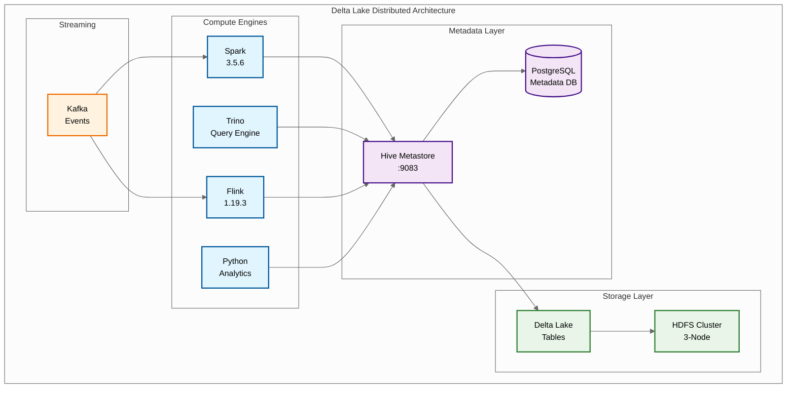
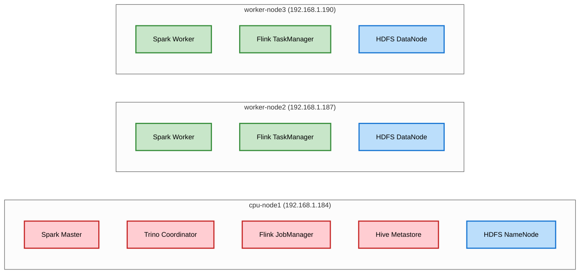
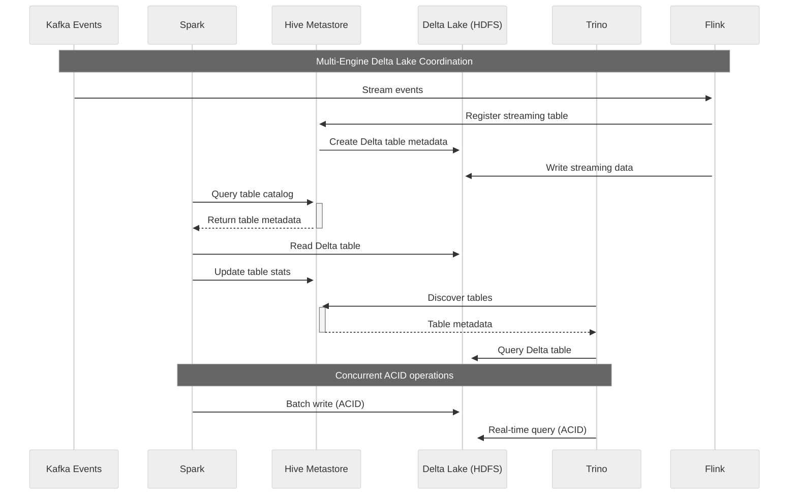
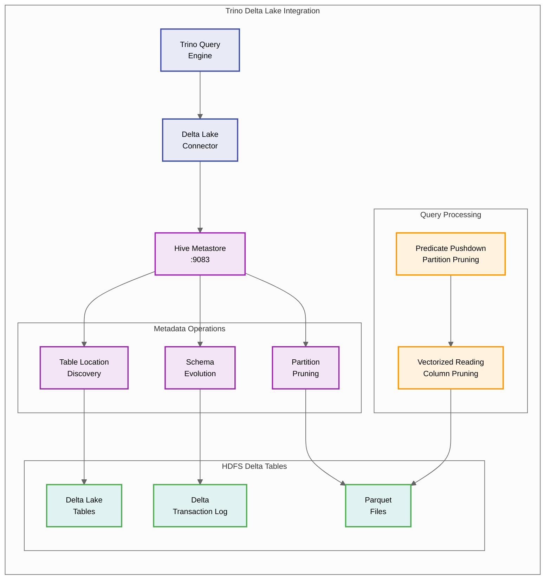
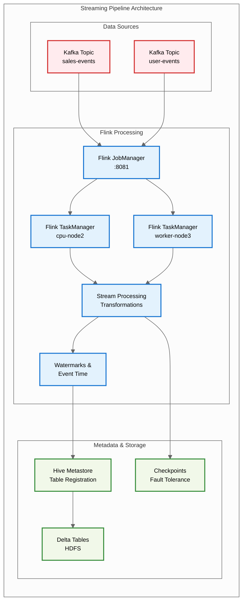
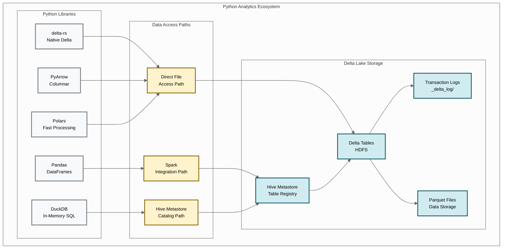
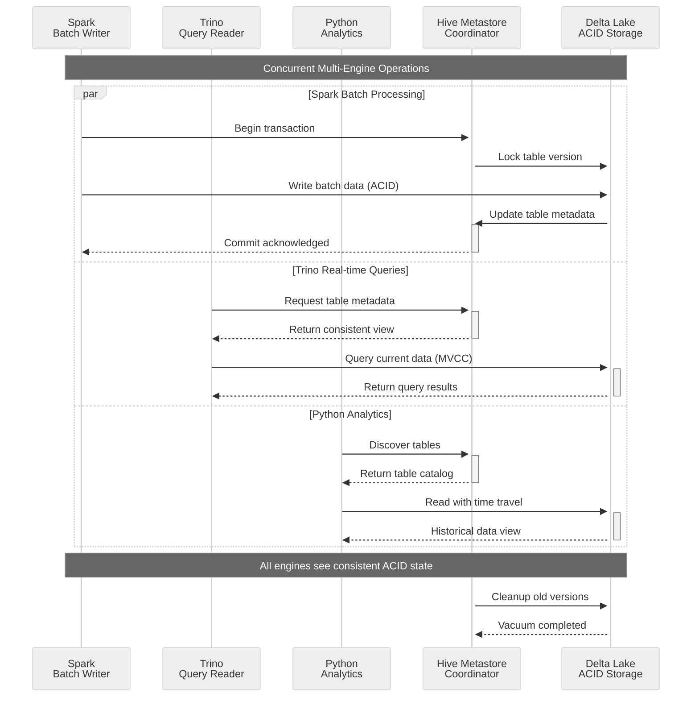

# Delta Lake Distributed & Comprehensive Setup Guide

## Overview

This guide sets up Delta Lake with distributed HDFS storage, Hive Metastore integration, and multi-engine coordination across Spark, Trino, Flink, and Python analytics in your 3-node cluster.

## Prerequisites

✅ **Must be completed first:**
- [06_hdfs_distributed_setup.md](./06_hdfs_distributed_setup.md) - HDFS cluster running
- [07_hive_metastore_setup.md](./07_hive_metastore_setup.md) - Hive Metastore service  
- All cluster components operational (Spark, Flink, Trino, Kafka, PostgreSQL)

## Hive Metastore Integration Architecture

**Why Hive Metastore is Critical for Delta Lake:**
- **Cross-engine table discovery**: Spark creates tables → Trino sees them instantly
- **Schema evolution tracking**: Version management across all engines  
- **ACID metadata operations**: Concurrent access without corruption
- **Unified catalog**: Single source of truth for all table metadata

### Delta Lake Distributed Architecture



### Node Architecture

The following diagram shows how Delta Lake components are distributed across your 3-node cluster:



### Multi-Engine Data Flow Coordination

This sequence diagram illustrates how multiple engines coordinate through Hive Metastore for Delta Lake operations:



## Phase 1: Core Distributed Setup

### 📋 Quick Node Reference Summary

**Primary Setup Node**: All initial setup and master services run on `cpu-node1 (192.168.1.184)`
**Distribution**: Flink JARs must be copied to worker nodes `(192.168.1.187)` and `(192.168.1.190)`
**Python Dependencies**: Install on ALL nodes for distributed analytics

> **⚠️ Important**: Verify your actual worker node IP addresses by checking `curl -s http://192.168.1.184:8080 | grep worker` before proceeding. The worker nodes shown here are based on active Spark cluster discovery.

| Component | Node(s) | Purpose |
|-----------|---------|---------|
| Delta Lake Workspace | cpu-node1 | Main setup and configuration files |
| Spark Master | cpu-node1 | Spark Delta Lake processing |
| Trino Coordinator | cpu-node1 | SQL queries and Delta Lake connector |
| Hive Metastore | cpu-node1 | Table metadata and schema management |
| Flink JobManager | cpu-node1 | Stream processing coordination |
| Flink TaskManager JARs | 192.168.1.187, 192.168.1.190 | Distributed stream processing |
| Python Analytics | ALL nodes | Distributed analytics capabilities |

---

### Step 1: Setup Delta Lake Workspace and Dependencies

#### 🖥️ **ON cpu-node1 (192.168.1.184) - Master Node**

Create the main Delta Lake workspace directory structure:

```bash
# Create new distributed workspace on master node (cpu-node1)
ssh sanzad@192.168.1.184
mkdir -p /home/sanzad/deltalake-distributed
cd /home/sanzad/deltalake-distributed

# Create required directories
mkdir -p libs
mkdir -p conf
mkdir -p scripts
mkdir -p notebooks
mkdir -p logs
mkdir -p checkpoints
```

Download all required JAR files to the master node:

```bash
# Ensure you're on cpu-node1 and in the correct directory
cd /home/sanzad/deltalake-distributed/libs

# Core Delta Lake JARs
wget https://repo1.maven.org/maven2/io/delta/delta-core_2.12/2.4.0/delta-core_2.12-2.4.0.jar
wget https://repo1.maven.org/maven2/io/delta/delta-storage/2.4.0/delta-storage-2.4.0.jar

# Delta Lake Flink connector
wget https://repo1.maven.org/maven2/io/delta/delta-flink/3.3.2/delta-flink-3.3.2.jar

# Hadoop integration
wget https://repo1.maven.org/maven2/org/apache/hadoop/hadoop-client/3.3.6/hadoop-client-3.3.6.jar

# Database drivers
wget https://jdbc.postgresql.org/download/postgresql-42.7.2.jar

# Additional dependencies
wget https://repo1.maven.org/maven2/org/antlr/antlr4-runtime/4.8/antlr4-runtime-4.8.jar
```

### Step 2: Distributed Spark Configuration

#### 🖥️ **CONTINUE ON cpu-node1 (192.168.1.184) - Master Node**

Create Spark configuration file for Delta Lake:

```bash
# Still on cpu-node1, create Spark configuration
nano /home/sanzad/deltalake-distributed/conf/spark-delta-distributed.conf
```

```properties
# Spark configuration for distributed Delta Lake
spark.sql.extensions=io.delta.sql.DeltaSparkSessionExtension
spark.sql.catalog.spark_catalog=org.apache.spark.sql.delta.catalog.DeltaCatalog

# HDFS configuration
spark.hadoop.fs.defaultFS=hdfs://192.168.1.184:9000

# Delta Lake warehouse location
spark.sql.warehouse.dir=hdfs://192.168.1.184:9000/lakehouse/delta-lake

# Performance optimization for distributed setup
spark.serializer=org.apache.spark.serializer.KryoSerializer
spark.sql.adaptive.enabled=true
spark.sql.adaptive.coalescePartitions.enabled=true
spark.sql.adaptive.coalescePartitions.minPartitionNum=2
spark.sql.adaptive.coalescePartitions.initialPartitionNum=8

# Optimize for your 3-node cluster
spark.sql.shuffle.partitions=12
spark.dynamicAllocation.enabled=true
spark.dynamicAllocation.minExecutors=1
spark.dynamicAllocation.maxExecutors=6

# Delta Lake specific configurations
spark.databricks.delta.retentionDurationCheck.enabled=false
spark.databricks.delta.vacuum.parallelDelete.enabled=true
spark.databricks.delta.merge.repartitionBeforeWrite.enabled=true
spark.databricks.delta.optimize.maxFileSize=134217728
spark.databricks.delta.optimize.minFileSize=8388608

# Checkpoint and streaming settings
spark.sql.streaming.checkpointLocation=hdfs://192.168.1.184:9000/lakehouse/checkpoints
spark.eventLog.enabled=true
spark.eventLog.dir=hdfs://192.168.1.184:9000/lakehouse/spark/event-logs

# HDFS client settings
spark.hadoop.dfs.client.use.datanode.hostname=false
spark.hadoop.dfs.client.cache.drop.behind.reads=true
```

#### 🖥️ **STILL ON cpu-node1 (192.168.1.184) - Master Node**

Create distributed Spark launch script:

```bash
# Still on cpu-node1, create Spark launch script
nano /home/sanzad/deltalake-distributed/start-spark-delta-distributed.sh
```

```bash
#!/bin/bash

DELTA_HOME="/home/sanzad/deltalake-distributed"
SPARK_HOME="/home/spark/spark"
HADOOP_HOME="/opt/hadoop/current"

export JAVA_HOME=/usr/lib/jvm/java-11-openjdk-amd64
export HADOOP_CONF_DIR=$HADOOP_HOME/etc/hadoop

# Build classpath with all required JARs
DELTA_JARS="${DELTA_HOME}/libs/delta-core_2.12-2.4.0.jar,${DELTA_HOME}/libs/delta-storage-2.4.0.jar"
HADOOP_JARS="${DELTA_HOME}/libs/hadoop-client-3.3.6.jar"
POSTGRES_JAR="${DELTA_HOME}/libs/postgresql-42.7.2.jar"
ANTLR_JAR="${DELTA_HOME}/libs/antlr4-runtime-4.8.jar"

ALL_JARS="${DELTA_JARS},${HADOOP_JARS},${POSTGRES_JAR},${ANTLR_JAR}"

echo "Starting Spark with distributed Delta Lake..."
echo "HDFS Warehouse: hdfs://192.168.1.184:9000/lakehouse/delta-lake"

# Start Spark with distributed configuration
$SPARK_HOME/bin/spark-shell \
    --master spark://192.168.1.184:7077 \
    --jars $ALL_JARS \
    --conf "spark.sql.extensions=io.delta.sql.DeltaSparkSessionExtension" \
    --conf "spark.sql.catalog.spark_catalog=org.apache.spark.sql.delta.catalog.DeltaCatalog" \
    --conf "spark.hadoop.fs.defaultFS=hdfs://192.168.1.184:9000" \
    --conf "spark.sql.warehouse.dir=hdfs://192.168.1.184:9000/lakehouse/delta-lake" \
    --conf "spark.databricks.delta.retentionDurationCheck.enabled=false" \
    --conf "spark.sql.streaming.checkpointLocation=hdfs://192.168.1.184:9000/lakehouse/checkpoints" \
    --conf "spark.eventLog.dir=hdfs://192.168.1.184:9000/lakehouse/spark/event-logs" \
    --conf "spark.sql.adaptive.enabled=true" \
    --conf "spark.sql.shuffle.partitions=12" \
    --executor-memory 2g \
    --driver-memory 1g \
    --executor-cores 2 \
    --total-executor-cores 6
```

#### 🖥️ **STILL ON cpu-node1 (192.168.1.184) - Master Node**

Create PySpark distributed launch script:

```bash
# Still on cpu-node1, create PySpark launch script
nano /home/sanzad/deltalake-distributed/start-pyspark-delta-distributed.sh
```

```bash
#!/bin/bash

DELTA_HOME="/home/sanzad/deltalake-distributed"
SPARK_HOME="/home/spark/spark"
HADOOP_HOME="/opt/hadoop/current"

export JAVA_HOME=/usr/lib/jvm/java-11-openjdk-amd64
export HADOOP_CONF_DIR=$HADOOP_HOME/etc/hadoop
export PYSPARK_PYTHON=python3

# Build classpath
DELTA_JARS="${DELTA_HOME}/libs/delta-core_2.12-2.4.0.jar,${DELTA_HOME}/libs/delta-storage-2.4.0.jar"
HADOOP_JARS="${DELTA_HOME}/libs/hadoop-client-3.3.6.jar"
POSTGRES_JAR="${DELTA_HOME}/libs/postgresql-42.7.2.jar"

ALL_JARS="${DELTA_JARS},${HADOOP_JARS},${POSTGRES_JAR}"

echo "Starting PySpark with distributed Delta Lake..."

# Start PySpark with distributed configuration
$SPARK_HOME/bin/pyspark \
    --master spark://192.168.1.184:7077 \
    --jars $ALL_JARS \
    --conf "spark.sql.extensions=io.delta.sql.DeltaSparkSessionExtension" \
    --conf "spark.sql.catalog.spark_catalog=org.apache.spark.sql.delta.catalog.DeltaCatalog" \
    --conf "spark.hadoop.fs.defaultFS=hdfs://192.168.1.184:9000" \
    --conf "spark.sql.warehouse.dir=hdfs://192.168.1.184:9000/lakehouse/delta-lake" \
    --conf "spark.databricks.delta.retentionDurationCheck.enabled=false"
```

Make scripts executable (still on cpu-node1):

```bash
# Still on cpu-node1, make scripts executable
chmod +x /home/sanzad/deltalake-distributed/start-spark-delta-distributed.sh
chmod +x /home/sanzad/deltalake-distributed/start-pyspark-delta-distributed.sh
```

### Step 2.5: Prepare HDFS Directories and Services

#### 🖥️ **STILL ON cpu-node1 (192.168.1.184) - Master Node**

Before testing the Delta Lake setup, we need to create required HDFS directories and ensure all Spark services are running:

**Create Required HDFS Directories:**

```bash
# Create missing HDFS directories for Delta Lake operations
/opt/hadoop/current/bin/hdfs dfs -mkdir -p /lakehouse/checkpoints
/opt/hadoop/current/bin/hdfs dfs -mkdir -p /lakehouse/spark/event-logs

# Set proper permissions for multi-user access
/opt/hadoop/current/bin/hdfs dfs -chmod 777 /lakehouse/checkpoints
/opt/hadoop/current/bin/hdfs dfs -chmod 777 /lakehouse/spark/event-logs
```

**Fix Event Log Directory Configuration:**

The Spark History Server uses `/lakehouse/spark/event-logs` but our script was configured for `/spark-logs`. Fix this:

```bash
# Update the Spark Delta script to use correct event log directory  
sed -i 's|spark.eventLog.dir=hdfs://192.168.1.184:9000/spark-logs|spark.eventLog.dir=hdfs://192.168.1.184:9000/lakehouse/spark/event-logs|g' /home/sanzad/deltalake-distributed/start-spark-delta-distributed.sh
```

**Ensure Spark Cluster is Running:**

```bash
# Start and enable Spark Worker service (if not running)
sudo systemctl start spark-worker
sudo systemctl enable spark-worker

# Verify all Spark services are active
systemctl is-active spark-master spark-worker
```

**Verify HDFS Directory Creation:**

```bash
# Verify directories were created successfully
/opt/hadoop/current/bin/hdfs dfs -ls /lakehouse/checkpoints /lakehouse/spark/event-logs

# Check overall lakehouse structure
/opt/hadoop/current/bin/hdfs dfs -ls /lakehouse/
```

### Step 3: Test Distributed Setup

#### 🖥️ **STILL ON cpu-node1 (192.168.1.184) - Master Node**

Start distributed Spark session to test the setup:

```bash
# On cpu-node1, start distributed Spark session (run as spark user)
sudo su - spark -c "cd /home/sanzad/deltalake-distributed && ./start-spark-delta-distributed.sh"
```

```scala
// Test distributed Delta Lake setup
import io.delta.tables._
import org.apache.spark.sql.functions._
import org.apache.spark.sql.types._

// Create distributed Delta table with partitioning
val distributedPath = "hdfs://192.168.1.184:9000/lakehouse/delta-lake/sales_transactions"

// Generate sample sales data across multiple regions and time periods
val regions = Array("us-east", "us-west", "eu-central", "asia-pacific")
val products = Array("laptop", "phone", "tablet", "headphones", "camera")

val salesData = (1 to 50000).map { i =>
  val region = regions(i % regions.length)
  val product = products(i % products.length)
  val quantity = scala.util.Random.nextInt(10) + 1
  val price = BigDecimal((scala.util.Random.nextDouble() * 1000 + 50).round / 100.0)
  val month = (i % 12) + 1
  val day = (i % 28) + 1
  val saleDate = java.sql.Date.valueOf(f"2024-$month%02d-$day%02d")
  
  (i.toLong, product, quantity, price, region, saleDate, 2024, month)
}

val salesDF = salesData.toDF("transaction_id", "product", "quantity", "price", "region", "sale_date", "year", "month")

// Write as partitioned Delta table
salesDF.write
  .format("delta")
  .mode("overwrite")
  .partitionBy("region", "year", "month")
  .save(distributedPath)

// Create table reference for SQL access
spark.sql(s"""
  CREATE TABLE sales_transactions 
  USING DELTA 
  LOCATION '$distributedPath'
""")

// Verify data distribution
spark.sql("SELECT region, year, month, count(*) as transaction_count FROM sales_transactions GROUP BY region, year, month ORDER BY region, year, month").show()

// Check Delta table properties
val deltaTable = DeltaTable.forPath(spark, distributedPath)
deltaTable.detail().show(false)
```

## Phase 2: Trino Integration with Hive Metastore

### Step 4: Configure Trino for Delta Lake with Hive Metastore

#### 🖥️ **ON cpu-node1 (192.168.1.184) - Master Node**

**🚨 CRITICAL:** Trino's Delta Lake connector **requires** Hive Metastore for table discovery and metadata management.

### Trino-Delta Lake-Metastore Integration Flow

This diagram shows how Trino processes Delta Lake queries through Hive Metastore:



#### Create Enhanced Trino Delta Catalog:

```bash
# On cpu-node1, create comprehensive delta.properties with Hive Metastore integration
sudo tee /home/trino/trino/etc/catalog/delta.properties > /dev/null << 'EOF'
connector.name=delta-lake

# ===== HIVE METASTORE INTEGRATION (CRITICAL) =====
hive.metastore.uri=thrift://192.168.1.184:9083
hive.metastore.username=hive

# HDFS configuration for distributed storage
hive.hdfs.authentication.type=NONE
hive.hdfs.impersonation.enabled=false

# Delta Lake warehouse location (must match Spark config)
delta.default.warehouse.path=hdfs://192.168.1.184:9000/lakehouse/delta-lake

# ===== PERFORMANCE OPTIMIZATIONS =====
delta.enable-non-concurrent-writes=true
delta.max-partitions-per-query=1000
delta.table-statistics-enabled=true
delta.collect-extended-statistics-on-write=true
delta.vacuum.min-retention=168h
delta.checkpoint.interval=10

# Query optimization features
delta.checkpoint-filtering.enabled=true
delta.dynamic-filtering.enabled=true
delta.projection-pushdown.enabled=true

# Performance settings for distributed workloads
delta.compression-codec=ZSTD
delta.max-outstanding-splits=1000
delta.domain-compaction-threshold=1000

# Multi-engine coordination settings
delta.register-table-procedure.enabled=true
delta.auto-register-table.enabled=false
EOF

# Restart Trino service on cpu-node1 to apply new configuration
sudo systemctl restart trino
```

### Test Trino Integration

#### 🖥️ **ON cpu-node1 (192.168.1.184) - Master Node**

Connect to Trino and test the Delta Lake integration:

```bash
# On cpu-node1, connect to local Trino instance
trino --server http://192.168.1.184:8080 --catalog delta --schema default
```

```sql
-- Register Delta table with Trino (if needed)
CALL delta.system.register_table(
    'default', 
    'sales_transactions', 
    'hdfs://192.168.1.184:9000/lakehouse/delta-lake/sales_transactions'
);

-- Query distributed Delta table from Trino
SELECT region, product, 
       count(*) as transaction_count,
       sum(quantity * price) as total_revenue 
FROM sales_transactions 
GROUP BY region, product 
ORDER BY total_revenue DESC
LIMIT 20;

-- Test time travel
SELECT count(*) FROM sales_transactions FOR VERSION AS OF 1;

-- Analyze performance with advanced aggregations
SELECT 
    region,
    year,
    month,
    count(*) as transactions,
    sum(quantity * price) as revenue,
    avg(price) as avg_price,
    percentile_cont(0.5) WITHIN GROUP (ORDER BY price) as median_price
FROM sales_transactions 
WHERE year = 2024
GROUP BY region, year, month
ORDER BY region, year, month;
```

## Phase 3: Flink Streaming Integration

### Flink-Kafka-Delta Lake Streaming Pipeline

This diagram shows how Flink processes streaming data from Kafka into Delta Lake tables:



### Step 5: Configure Flink for Delta Lake Streaming

#### 🖥️ **ON cpu-node1 (192.168.1.184) - Master Node (JobManager)**

Configure Flink JobManager for Delta Lake streaming:

```bash
# On cpu-node1, copy Delta Lake Flink JARs to Flink lib directory
sudo cp /home/sanzad/deltalake-distributed/libs/delta-flink-3.3.2.jar /home/flink/flink/lib/
sudo cp /home/sanzad/deltalake-distributed/libs/hadoop-client-3.3.6.jar /home/flink/flink/lib/

# Update Flink configuration for Delta Lake on cpu-node1
sudo nano /home/flink/flink/conf/flink-conf.yaml
```

Add these lines:
```yaml
# HDFS configuration
fs.hdfs.hadoop.conf.dir: /opt/hadoop/current/etc/hadoop

# Delta Lake configuration
table.sql-dialect: default
```

#### 📋 **DISTRIBUTE JARS TO WORKER NODES**

Copy the same Delta Lake JARs to all Flink TaskManager nodes:

```bash
# Copy JARs to worker-node2 (TaskManager)
ssh sanzad@192.168.1.187 "sudo mkdir -p /tmp/flink-jars"
scp /home/sanzad/deltalake-distributed/libs/delta-flink-3.3.2.jar sanzad@192.168.1.187:/tmp/flink-jars/
scp /home/sanzad/deltalake-distributed/libs/hadoop-client-3.3.6.jar sanzad@192.168.1.187:/tmp/flink-jars/
ssh sanzad@192.168.1.187 "sudo mv /tmp/flink-jars/*.jar /home/flink/flink/lib/ && sudo chown flink:flink /home/flink/flink/lib/*.jar"

# Copy JARs to worker-node3 (TaskManager)
ssh sanzad@192.168.1.190 "sudo mkdir -p /tmp/flink-jars"
scp /home/sanzad/deltalake-distributed/libs/delta-flink-3.3.2.jar sanzad@192.168.1.190:/tmp/flink-jars/
scp /home/sanzad/deltalake-distributed/libs/hadoop-client-3.3.6.jar sanzad@192.168.1.190:/tmp/flink-jars/
ssh sanzad@192.168.1.190 "sudo mv /tmp/flink-jars/*.jar /home/flink/flink/lib/ && sudo chown flink:flink /home/flink/flink/lib/*.jar"
```

Restart Flink cluster to load new JARs:

```bash
# On cpu-node1, restart Flink cluster
sudo systemctl restart flink-jobmanager

# On worker-node2, restart TaskManager
ssh sanzad@192.168.1.187 "sudo systemctl restart flink-taskmanager"

# On worker-node3, restart TaskManager  
ssh sanzad@192.168.1.190 "sudo systemctl restart flink-taskmanager"
```

### Create Flink Streaming to Delta Lake Script

#### 🖥️ **ON cpu-node1 (192.168.1.184) - Master Node**

Create the Flink streaming script:

```bash
# On cpu-node1, create Flink streaming script
nano /home/sanzad/deltalake-distributed/scripts/flink_kafka_to_delta.py
```

```python
from pyflink.table import EnvironmentSettings, TableEnvironment
from pyflink.table.expressions import col
import os

def kafka_to_delta_streaming():
    # Set up Flink environment
    env_settings = EnvironmentSettings.new_instance().in_streaming_mode().build()
    table_env = TableEnvironment.create(env_settings)
    
    # Add Delta Lake JAR
    delta_jar = "file:///home/flink/flink/lib/delta-flink-3.3.2.jar"
    table_env.get_config().get_configuration().set_string("pipeline.jars", delta_jar)
    
    # Create Kafka source table
    table_env.execute_sql("""
        CREATE TABLE kafka_sales_events (
            transaction_id BIGINT,
            product STRING,
            quantity INT,
            price DECIMAL(10,2),
            region STRING,
            sale_timestamp TIMESTAMP(3),
            processing_time AS PROCTIME(),
            sale_time_attr AS sale_timestamp,
            WATERMARK FOR sale_time_attr AS sale_time_attr - INTERVAL '5' SECOND
        ) WITH (
            'connector' = 'kafka',
            'topic' = 'sales-events',
            'properties.bootstrap.servers' = '192.168.1.184:9092,192.168.1.187:9092,192.168.1.190:9092',
            'properties.group.id' = 'delta-sink',
            'format' = 'json',
            'scan.startup.mode' = 'latest-offset'
        )
    """)
    
    # Create Delta Lake sink table
    table_env.execute_sql("""
        CREATE TABLE streaming_sales_delta (
            transaction_id BIGINT,
            product STRING,
            quantity INT,
            price DECIMAL(10,2),
            region STRING,
            sale_timestamp TIMESTAMP(3),
            year INT,
            month INT,
            day INT,
            hour INT
        ) WITH (
            'connector' = 'delta',
            'table-path' = 'hdfs://192.168.1.184:9000/lakehouse/delta-lake/streaming_sales'
        )
    """)
    
    # Stream from Kafka to Delta Lake with transformations
    table_env.execute_sql("""
        INSERT INTO streaming_sales_delta
        SELECT 
            transaction_id,
            product,
            quantity,
            price,
            region,
            sale_timestamp,
            EXTRACT(YEAR FROM sale_timestamp) as year,
            EXTRACT(MONTH FROM sale_timestamp) as month,
            EXTRACT(DAY FROM sale_timestamp) as day,
            EXTRACT(HOUR FROM sale_timestamp) as hour
        FROM kafka_sales_events
    """)
    
    print("Kafka to Delta Lake streaming started...")

if __name__ == "__main__":
    kafka_to_delta_streaming()
```

## Phase 4: Python Analytics Integration

### Python Delta Lake Analytics Architecture

This diagram shows how Python integrates with Delta Lake through multiple pathways:



### Step 6: Enhanced Python Setup with delta-rs

#### 🖥️ **ON ALL NODES (192.168.1.184, 192.168.1.187, 192.168.1.190)**

Install Python dependencies on all nodes for distributed analytics:

```bash
# Run this command on ALL nodes (cpu-node1, worker-node2, worker-node3)
# On cpu-node1:
pip3 install deltalake pandas pyarrow duckdb polars sqlalchemy

# On worker-node2:
ssh sanzad@192.168.1.187 "pip3 install deltalake pandas pyarrow duckdb polars sqlalchemy"

# On worker-node3:
ssh sanzad@192.168.1.190 "pip3 install deltalake pandas pyarrow duckdb polars sqlalchemy"
```

### Create Comprehensive Python Analytics Script

#### 🖥️ **ON cpu-node1 (192.168.1.184) - Master Node**

Create the Python analytics script:

```bash
# On cpu-node1, create Python analytics script
nano /home/sanzad/deltalake-distributed/scripts/python_analytics_comprehensive.py
```

```python
import os
import pandas as pd
import pyarrow as pa
import pyarrow.parquet as pq
import duckdb
from deltalake import DeltaTable, write_deltalake
from datetime import datetime, timedelta
import numpy as np

class DeltaLakeAnalytics:
    def __init__(self):
        # Set HDFS configuration for delta-rs
        os.environ["DELTA_RS_HDFS_CONF_DIR"] = "/opt/hadoop/current/etc/hadoop"
        
        # Initialize DuckDB for local analytics
        self.duck_conn = duckdb.connect()
        
        # Enable HDFS support in DuckDB
        self.duck_conn.execute("INSTALL httpfs")
        self.duck_conn.execute("LOAD httpfs")
    
    def read_delta_table(self, table_path: str, version: int = None):
        """Read Delta table with optional version (time travel)"""
        try:
            if version is not None:
                dt = DeltaTable(table_path, version=version)
            else:
                dt = DeltaTable(table_path)
            
            return dt.to_pandas()
        except Exception as e:
            print(f"Error reading Delta table: {e}")
            return None
    
    def predicate_pushdown_query(self, table_path: str, region: str = None, min_price: float = None):
        """Demonstrate predicate pushdown for efficient querying"""
        try:
            dt = DeltaTable(table_path)
            
            # Build filter conditions
            filters = []
            if region:
                filters.append(('region', '=', region))
            if min_price:
                filters.append(('price', '>=', min_price))
            
            # Apply filters and convert to pandas
            if filters:
                return dt.to_pandas(filters=filters)
            else:
                return dt.to_pandas()
                
        except Exception as e:
            print(f"Error in predicate pushdown: {e}")
            return None
    
    def time_travel_analysis(self, table_path: str):
        """Demonstrate time travel capabilities"""
        try:
            dt = DeltaTable(table_path)
            
            # Get table history
            history = dt.history()
            
            # Convert to more readable format
            history_data = []
            for entry in history:
                history_data.append({
                    'version': entry['version'],
                    'timestamp': pd.to_datetime(entry['timestamp']),
                    'operation': entry['operation'],
                    'operationParameters': entry.get('operationParameters', {}),
                    'readVersion': entry.get('readVersion'),
                    'isBlindAppend': entry.get('isBlindAppend', False)
                })
            
            return pd.DataFrame(history_data)
            
        except Exception as e:
            print(f"Error in time travel analysis: {e}")
            return None
    
    def write_delta_from_pandas(self, df: pd.DataFrame, table_path: str, partition_by: list = None, mode: str = "overwrite"):
        """Write pandas DataFrame to Delta table"""
        try:
            write_deltalake(
                table_or_uri=table_path,
                data=df,
                partition_by=partition_by,
                mode=mode,
                overwrite_schema=True
            )
            print(f"✓ Successfully wrote {len(df)} records to Delta table")
        except Exception as e:
            print(f"Error writing to Delta table: {e}")
    
    def merge_operation_simulation(self, table_path: str):
        """Simulate MERGE/UPSERT operation using delta-rs"""
        try:
            # Read existing data
            dt = DeltaTable(table_path)
            existing_df = dt.to_pandas()
            
            if existing_df.empty:
                print("No existing data to merge with")
                return
            
            # Create new data for merge (some updates, some inserts)
            new_data = []
            
            # Updates: modify some existing records
            sample_existing = existing_df.sample(min(100, len(existing_df)))
            for _, row in sample_existing.iterrows():
                new_data.append({
                    'transaction_id': row['transaction_id'],
                    'product': row['product'],
                    'quantity': row['quantity'] + np.random.randint(1, 5),  # Update quantity
                    'price': row['price'] * (1 + np.random.uniform(-0.1, 0.1)),  # Update price
                    'region': row['region'],
                    'sale_date': row['sale_date'],
                    'year': row['year'],
                    'month': row['month']
                })
            
            # Inserts: add some new records
            max_id = existing_df['transaction_id'].max()
            for i in range(50):
                new_data.append({
                    'transaction_id': max_id + i + 1,
                    'product': np.random.choice(['laptop', 'phone', 'tablet']),
                    'quantity': np.random.randint(1, 10),
                    'price': np.random.uniform(100, 1000),
                    'region': np.random.choice(['us-east', 'us-west', 'eu-central', 'asia-pacific']),
                    'sale_date': datetime.now().date(),
                    'year': 2024,
                    'month': datetime.now().month
                })
            
            new_df = pd.DataFrame(new_data)
            
            # Write as new version (append mode simulates merge)
            self.write_delta_from_pandas(
                new_df, 
                table_path + "_updates", 
                partition_by=['region', 'year', 'month'],
                mode="overwrite"
            )
            
            print(f"✓ Created merge simulation with {len(new_data)} records")
            
        except Exception as e:
            print(f"Error in merge operation: {e}")
    
    def duckdb_delta_integration(self, table_path: str):
        """Use DuckDB to query Delta table alongside other sources"""
        try:
            # Read Delta table into DuckDB
            dt = DeltaTable(table_path)
            delta_df = dt.to_pandas()
            
            # Register DataFrame in DuckDB
            self.duck_conn.register('delta_sales', delta_df)
            
            # Query PostgreSQL data
            pg_query = """
            SELECT region, SUM(amount) as pg_total_sales
            FROM postgres_scan('host=192.168.1.184 port=5432 dbname=analytics_db user=dataeng password=password', 'public', 'sales_data')
            GROUP BY region
            """
            
            try:
                pg_data = self.duck_conn.execute(pg_query).fetchdf()
            except:
                # If PostgreSQL connection fails, create mock data
                pg_data = pd.DataFrame({
                    'region': ['us-east', 'us-west', 'eu-central', 'asia-pacific'],
                    'pg_total_sales': [50000, 45000, 60000, 35000]
                })
                self.duck_conn.register('pg_sales', pg_data)
            
            # Federated query combining Delta Lake and PostgreSQL data
            federated_query = """
            SELECT 
                d.region,
                COUNT(*) as delta_transaction_count,
                SUM(d.quantity * d.price) as delta_total_sales,
                COALESCE(p.pg_total_sales, 0) as pg_total_sales,
                SUM(d.quantity * d.price) + COALESCE(p.pg_total_sales, 0) as combined_total
            FROM delta_sales d
            LEFT JOIN pg_sales p ON d.region = p.region
            GROUP BY d.region, p.pg_total_sales
            ORDER BY combined_total DESC
            """
            
            result = self.duck_conn.execute(federated_query).fetchdf()
            return result
            
        except Exception as e:
            print(f"Error in DuckDB integration: {e}")
            return None
    
    def polars_performance_analysis(self, table_path: str):
        """Use Polars for high-performance analytics on Delta data"""
        try:
            import polars as pl
            
            # Read Delta table
            dt = DeltaTable(table_path)
            pandas_df = dt.to_pandas()
            
            # Convert to Polars for high-performance operations
            df = pl.from_pandas(pandas_df)
            
            # Perform complex aggregations
            result = (
                df
                .filter(pl.col("year") == 2024)
                .with_columns([
                    (pl.col("quantity") * pl.col("price")).alias("revenue"),
                    pl.col("sale_date").str.to_datetime().alias("sale_datetime")
                ])
                .group_by(["region", "product"])
                .agg([
                    pl.count().alias("transaction_count"),
                    pl.col("revenue").sum().alias("total_revenue"),
                    pl.col("revenue").mean().alias("avg_revenue"),
                    pl.col("revenue").std().alias("revenue_std"),
                    pl.col("quantity").sum().alias("total_quantity"),
                    pl.col("sale_datetime").min().alias("first_sale"),
                    pl.col("sale_datetime").max().alias("last_sale")
                ])
                .sort("total_revenue", descending=True)
            )
            
            return result.to_pandas()
            
        except ImportError:
            print("Polars not available, falling back to pandas")
            return None
        except Exception as e:
            print(f"Error in Polars analysis: {e}")
            return None
    
    def advanced_analytics_pipeline(self, table_path: str):
        """Advanced analytics pipeline with Delta Lake"""
        try:
            dt = DeltaTable(table_path)
            df = dt.to_pandas()
            
            if df.empty:
                return None
            
            # Convert price to numeric if it's not already
            df['price'] = pd.to_numeric(df['price'], errors='coerce')
            df['quantity'] = pd.to_numeric(df['quantity'], errors='coerce')
            df['revenue'] = df['quantity'] * df['price']
            
            # Time series analysis
            df['sale_date'] = pd.to_datetime(df['sale_date'])
            df.set_index('sale_date', inplace=True)
            
            # Calculate rolling statistics
            daily_stats = (
                df.groupby(['region', 'product'])
                .resample('D')
                .agg({
                    'revenue': ['sum', 'mean', 'count'],
                    'quantity': 'sum'
                })
                .round(2)
            )
            
            # Flatten column names
            daily_stats.columns = ['_'.join(col).strip() for col in daily_stats.columns]
            daily_stats = daily_stats.reset_index()
            
            # Calculate growth rates
            daily_stats = daily_stats.sort_values(['region', 'product', 'sale_date'])
            daily_stats['revenue_growth'] = daily_stats.groupby(['region', 'product'])['revenue_sum'].pct_change()
            
            return daily_stats
            
        except Exception as e:
            print(f"Error in advanced analytics: {e}")
            return None

def main():
    analytics = DeltaLakeAnalytics()
    
    print("=== Delta Lake Python Analytics Demo ===\n")
    
    # Define table path
    table_path = "hdfs://192.168.1.184:9000/lakehouse/delta-lake/sales_transactions"
    
    # 1. Basic table reading
    print("1. Reading Delta table...")
    try:
        df = analytics.read_delta_table(table_path)
        if df is not None:
            print(f"Read {len(df)} records from Delta table")
            print(f"Columns: {list(df.columns)}")
            print(f"Regions: {df['region'].unique()}")
        else:
            print("Failed to read Delta table")
    except Exception as e:
        print(f"Error reading table: {e}")
    
    print("\n" + "="*50 + "\n")
    
    # 2. Predicate pushdown query
    print("2. Predicate pushdown query...")
    try:
        filtered_df = analytics.predicate_pushdown_query(table_path, region="us-east", min_price=100.0)
        if filtered_df is not None:
            print(f"Filtered data: {len(filtered_df)} records for us-east region with price >= $100")
            print(f"Average price: ${filtered_df['price'].mean():.2f}")
    except Exception as e:
        print(f"Error in predicate pushdown: {e}")
    
    print("\n" + "="*50 + "\n")
    
    # 3. Time travel analysis
    print("3. Time travel analysis...")
    try:
        history = analytics.time_travel_analysis(table_path)
        if history is not None:
            print("Table history:")
            print(history[['version', 'timestamp', 'operation']])
    except Exception as e:
        print(f"Error in time travel: {e}")
    
    print("\n" + "="*50 + "\n")
    
    # 4. DuckDB federated query
    print("4. DuckDB federated analysis...")
    try:
        federated_result = analytics.duckdb_delta_integration(table_path)
        if federated_result is not None:
            print("Federated query result:")
            print(federated_result)
    except Exception as e:
        print(f"Error in federated query: {e}")
    
    print("\n" + "="*50 + "\n")
    
    # 5. Polars performance analysis
    print("5. Polars high-performance analysis...")
    try:
        polars_result = analytics.polars_performance_analysis(table_path)
        if polars_result is not None:
            print("Polars analysis result:")
            print(polars_result.head(10))
    except Exception as e:
        print(f"Error in Polars analysis: {e}")

if __name__ == "__main__":
    main()
```

## Phase 5: Multi-Engine Coordination

### Multi-Engine ACID Coordination Architecture

This diagram illustrates concurrent ACID operations across multiple engines on shared Delta Lake tables:



### Step 7: Multi-Engine Coordination for Delta Lake

#### 🖥️ **ON cpu-node1 (192.168.1.184) - Master Node**

Create the multi-engine coordination script:

```bash
# On cpu-node1, create multi-engine coordination script
nano /home/sanzad/deltalake-distributed/scripts/multi_engine_coordination.py
```

```python
from pyspark.sql import SparkSession
from delta.tables import *
import subprocess
import time
import threading
import pandas as pd

class DeltaLakeMultiEngineCoordinator:
    def __init__(self):
        self.spark = self._create_spark_session()
        
    def _create_spark_session(self):
        return SparkSession.builder \
            .appName("DeltaLakeMultiEngineCoordinator") \
            .config("spark.sql.extensions", "io.delta.sql.DeltaSparkSessionExtension") \
            .config("spark.sql.catalog.spark_catalog", "org.apache.spark.sql.delta.catalog.DeltaCatalog") \
            .config("spark.hadoop.fs.defaultFS", "hdfs://192.168.1.184:9000") \
            .config("spark.sql.warehouse.dir", "hdfs://192.168.1.184:9000/lakehouse/delta-lake") \
            .config("spark.databricks.delta.retentionDurationCheck.enabled", "false") \
            .getOrCreate()
    
    def create_optimized_table_for_multi_engine(self):
        """Create Delta table optimized for multi-engine access"""
        table_path = "hdfs://192.168.1.184:9000/lakehouse/delta-lake/multi_engine_orders"
        
        # Create schema-optimized table
        self.spark.sql("""
            CREATE TABLE IF NOT EXISTS delta.`hdfs://192.168.1.184:9000/lakehouse/delta-lake/multi_engine_orders` (
                order_id BIGINT,
                customer_id BIGINT,
                product_category STRING,
                order_amount DECIMAL(10,2),
                order_date DATE,
                order_timestamp TIMESTAMP,
                shipping_region STRING,
                payment_method STRING,
                order_status STRING,
                year INT,
                month INT,
                day INT
            ) USING DELTA
            PARTITIONED BY (shipping_region, year, month)
            TBLPROPERTIES (
                'delta.autoOptimize.optimizeWrite' = 'true',
                'delta.autoOptimize.autoCompact' = 'true',
                'delta.compatibility.symlinkFormatManifest.enabled' = 'true',
                'delta.logRetentionDuration' = '168 hours',
                'delta.deletedFileRetentionDuration' = '168 hours'
            )
        """)
        
        print("✓ Multi-engine optimized Delta table created")
        return table_path
    
    def spark_batch_processing(self, table_path: str):
        """Spark batch processing for Delta Lake"""
        print("🔄 Starting Spark batch processing...")
        
        from pyspark.sql.functions import *
        from pyspark.sql.types import *
        import random
        
        # Generate diverse batch data
        batch_size = 10000
        categories = ["Electronics", "Clothing", "Books", "Home", "Sports"]
        regions = ["us-east", "us-west", "eu-central", "asia-pacific"]
        payment_methods = ["credit_card", "debit_card", "paypal", "bank_transfer"]
        statuses = ["pending", "processing", "shipped", "delivered", "cancelled"]
        
        data = []
        for i in range(batch_size):
            order_date = f"2024-{random.randint(1, 12):02d}-{random.randint(1, 28):02d}"
            data.append((
                i + 100000,  # order_id
                random.randint(1, 10000),  # customer_id
                random.choice(categories),  # product_category
                round(random.uniform(10.0, 2000.0), 2),  # order_amount
                order_date,  # order_date
                f"{order_date} {random.randint(0, 23):02d}:{random.randint(0, 59):02d}:00",  # order_timestamp
                random.choice(regions),  # shipping_region
                random.choice(payment_methods),  # payment_method
                random.choice(statuses),  # order_status
                2024,  # year
                int(order_date.split('-')[1]),  # month
                int(order_date.split('-')[2])   # day
            ))
        
        columns = ["order_id", "customer_id", "product_category", "order_amount", 
                  "order_date", "order_timestamp", "shipping_region", "payment_method", 
                  "order_status", "year", "month", "day"]
        
        batch_df = self.spark.createDataFrame(data, columns)
        
        # Write to Delta table with optimizations
        batch_df.write \
            .format("delta") \
            .mode("append") \
            .option("mergeSchema", "true") \
            .save(table_path)
        
        print(f"✓ Spark batch processing completed: {batch_size} records")
    
    def demonstrate_acid_transactions(self, table_path: str):
        """Demonstrate ACID transactions with Delta Lake"""
        print("🔒 Demonstrating ACID transactions...")
        
        delta_table = DeltaTable.forPath(self.spark, table_path)
        
        # Simulate concurrent operations
        def update_operation():
            """Update order statuses"""
            try:
                delta_table.update(
                    condition = expr("order_status = 'pending' AND order_amount > 500"),
                    set = {"order_status": expr("'processing'")}
                )
                print("  ✓ Update operation completed")
            except Exception as e:
                print(f"  ❌ Update operation failed: {e}")
        
        def delete_operation():
            """Delete cancelled orders older than 30 days"""
            try:
                delta_table.delete(
                    condition = expr("order_status = 'cancelled' AND order_date < current_date() - interval 30 days")
                )
                print("  ✓ Delete operation completed")
            except Exception as e:
                print(f"  ❌ Delete operation failed: {e}")
        
        # Execute operations
        update_operation()
        delete_operation()
        
        print("✓ ACID transaction demonstration completed")
    
    def execute_trino_query(self, query: str):
        """Execute query via Trino CLI"""
        cmd = [
            "trino",
            "--server", "http://192.168.1.184:8080",
            "--catalog", "delta",
            "--schema", "default",
            "--execute", query
        ]
        
        try:
            result = subprocess.run(cmd, capture_output=True, text=True, timeout=120)
            return result.stdout
        except subprocess.TimeoutExpired:
            return "Query timeout"
        except Exception as e:
            return f"Error: {e}"
    
    def demonstrate_concurrent_read_write(self, table_path: str):
        """Demonstrate concurrent read/write operations"""
        print("🔄 Demonstrating concurrent read/write access...")
        
        def spark_writer():
            """Spark writing new data"""
            try:
                print("  Spark Writer: Adding new orders...")
                
                new_data = [(
                    200000 + i,  # order_id
                    1000 + i,    # customer_id
                    "Electronics",  # product_category
                    199.99,      # order_amount
                    "2024-06-15",  # order_date
                    "2024-06-15 12:00:00",  # order_timestamp
                    "us-east",   # shipping_region
                    "credit_card",  # payment_method
                    "pending",   # order_status
                    2024, 6, 15  # year, month, day
                ) for i in range(100)]
                
                columns = ["order_id", "customer_id", "product_category", "order_amount", 
                          "order_date", "order_timestamp", "shipping_region", "payment_method", 
                          "order_status", "year", "month", "day"]
                
                new_df = self.spark.createDataFrame(new_data, columns)
                new_df.write.format("delta").mode("append").save(table_path)
                
                print("  ✓ Spark Writer: 100 new orders added")
            except Exception as e:
                print(f"  ❌ Spark Writer failed: {e}")
        
        def spark_reader():
            """Spark reading and analyzing data"""
            try:
                print("  Spark Reader: Analyzing order patterns...")
                
                analysis = self.spark.read.format("delta").load(table_path) \
                    .groupBy("shipping_region", "product_category") \
                    .agg(
                        count("*").alias("order_count"),
                        sum("order_amount").alias("total_revenue"),
                        avg("order_amount").alias("avg_order_value")
                    ) \
                    .orderBy(desc("total_revenue"))
                
                result_count = analysis.count()
                print(f"  ✓ Spark Reader: Analysis completed, {result_count} region-category combinations")
            except Exception as e:
                print(f"  ❌ Spark Reader failed: {e}")
        
        def trino_reader():
            """Trino reading and querying data"""
            try:
                print("  Trino Reader: Running time-series analysis...")
                
                # Register table first
                register_query = f"""
                CALL delta.system.register_table(
                    'default', 
                    'multi_engine_orders', 
                    '{table_path}'
                )
                """
                self.execute_trino_query(register_query)
                
                # Run analysis query
                analysis_query = """
                SELECT 
                    shipping_region,
                    DATE_TRUNC('month', CAST(order_date AS DATE)) as month,
                    COUNT(*) as monthly_orders,
                    SUM(order_amount) as monthly_revenue
                FROM multi_engine_orders 
                WHERE year = 2024
                GROUP BY shipping_region, DATE_TRUNC('month', CAST(order_date AS DATE))
                ORDER BY shipping_region, month
                """
                
                result = self.execute_trino_query(analysis_query)
                print("  ✓ Trino Reader: Time-series analysis completed")
            except Exception as e:
                print(f"  ❌ Trino Reader failed: {e}")
        
        # Execute operations concurrently
        threads = [
            threading.Thread(target=spark_writer),
            threading.Thread(target=spark_reader),
            threading.Thread(target=trino_reader)
        ]
        
        for thread in threads:
            thread.start()
        
        for thread in threads:
            thread.join()
        
        print("✓ Concurrent access demonstration completed")
    
    def optimize_table_performance(self, table_path: str):
        """Optimize Delta table for multi-engine performance"""
        print("⚡ Optimizing table performance...")
        
        delta_table = DeltaTable.forPath(self.spark, table_path)
        
        try:
            # Z-order optimization for common query patterns
            delta_table.optimize().executeZOrderBy("shipping_region", "product_category", "order_date")
            print("  ✓ Z-order optimization completed")
        except Exception as e:
            print(f"  ⚠️  Z-order optimization failed: {e}")
        
        try:
            # Compact small files
            delta_table.optimize().executeCompaction()
            print("  ✓ File compaction completed")
        except Exception as e:
            print(f"  ⚠️  File compaction failed: {e}")
        
        try:
            # Vacuum old files (keep last 7 days)
            delta_table.vacuum(168)  # 168 hours = 7 days
            print("  ✓ Vacuum operation completed")
        except Exception as e:
            print(f"  ⚠️  Vacuum operation failed: {e}")
        
        print("✓ Table optimization completed")
    
    def monitor_table_health(self, table_path: str):
        """Monitor Delta table health and performance"""
        print("📊 Monitoring table health...")
        
        # Table statistics
        stats_df = self.spark.read.format("delta").load(table_path)
        
        total_records = stats_df.count()
        total_regions = stats_df.select("shipping_region").distinct().count()
        total_categories = stats_df.select("product_category").distinct().count()
        total_revenue = stats_df.agg(sum("order_amount")).collect()[0][0]
        
        print(f"  📈 Total records: {total_records:,}")
        print(f"  🌍 Unique regions: {total_regions}")
        print(f"  📦 Unique categories: {total_categories}")
        print(f"  💰 Total revenue: ${total_revenue:,.2f}")
        
        # File-level statistics
        delta_table = DeltaTable.forPath(self.spark, table_path)
        
        try:
            detail_df = delta_table.detail()
            detail = detail_df.collect()[0]
            
            print(f"  📁 Number of files: {detail['numFiles']}")
            print(f"  💾 Table size: {detail['sizeInBytes'] / (1024*1024):.2f} MB")
            print(f"  📅 Last modified: {detail['lastModified']}")
            
            if detail['numFiles'] > 1000:
                print("  ⚠️  Warning: Large number of files, consider compaction")
                
        except Exception as e:
            print(f"  ⚠️  Could not get detailed statistics: {e}")

def main():
    coordinator = DeltaLakeMultiEngineCoordinator()
    
    print("=== Delta Lake Multi-Engine Coordination Demo ===\n")
    
    # 1. Create optimized table
    table_path = coordinator.create_optimized_table_for_multi_engine()
    print()
    
    # 2. Spark batch processing
    coordinator.spark_batch_processing(table_path)
    print()
    
    # 3. ACID transaction demonstration
    coordinator.demonstrate_acid_transactions(table_path)
    print()
    
    # 4. Concurrent access demonstration
    coordinator.demonstrate_concurrent_read_write(table_path)
    print()
    
    # 5. Table optimization
    coordinator.optimize_table_performance(table_path)
    print()
    
    # 6. Health monitoring
    coordinator.monitor_table_health(table_path)
    
    print("\n🎉 Delta Lake multi-engine coordination demo completed!")

if __name__ == "__main__":
    main()
```

Make all scripts executable:

```bash
# On cpu-node1, make all scripts executable
chmod +x /home/sanzad/deltalake-distributed/scripts/*.py
```

This comprehensive Delta Lake setup provides:

**✅ Distributed HDFS Storage**: Data spread across all 3 nodes with replication
**✅ Spark Integration**: Full Delta Lake features with distributed processing
**✅ Trino Integration**: SQL queries with time travel and advanced analytics
**✅ Flink Streaming**: Real-time data ingestion from Kafka to Delta tables
**✅ Python Analytics**: delta-rs, pandas, DuckDB, and Polars integration
**✅ Multi-Engine Coordination**: Concurrent access patterns and ACID transactions
**✅ Performance Optimization**: Z-ordering, compaction, vacuum operations
**✅ Monitoring & Health Checks**: Comprehensive table and performance monitoring

---

# Appendix: Local Delta Lake Setup Guide

> **Note**: This local setup is for learning and development purposes. For production use, always use the distributed setup above.

## Overview
Delta Lake will be set up locally for lakehouse functionality, integrated with Spark for data processing and analytics. This setup allows you to experiment with Delta Lake's features like ACID transactions, schema enforcement, time travel, and data versioning.

## What is Delta Lake?
Delta Lake is an open-source storage framework that enables building a Lakehouse architecture with compute engines including Spark, PrestoDB, Flink, Trino, and Hive and APIs for Scala, Java, Rust, Ruby, and Python.

## Prerequisites
- Java 8 or Java 11
- Apache Spark 3.3+ (from our Spark cluster setup)
- Python 3.7+
- At least 4GB RAM
- At least 10GB free disk space for data and logs

## Key Benefits of Local Setup
1. **Learning Environment**: Perfect for understanding Delta Lake concepts
2. **Development & Testing**: Test applications before deploying to cluster
3. **Prototyping**: Quick setup for proof-of-concepts
4. **Data Quality Experimentation**: Test schema enforcement and constraints

## Step 1: Local Directory Setup

```bash
# Create Delta Lake workspace
mkdir -p /home/sanzad/deltalake-local
cd /home/sanzad/deltalake-local

# Create required directories
mkdir -p delta-tables
mkdir -p checkpoints
mkdir -p logs
mkdir -p data
mkdir -p notebooks
mkdir -p scripts
mkdir -p temp
```

## Step 2: Download Delta Lake JAR Files

```bash
cd /home/sanzad/deltalake-local
mkdir -p libs

# Download Delta Lake core for Spark
wget -P libs https://repo1.maven.org/maven2/io/delta/delta-core_2.12/2.4.0/delta-core_2.12-2.4.0.jar

# Download Delta Lake storage
wget -P libs https://repo1.maven.org/maven2/io/delta/delta-storage/2.4.0/delta-storage-2.4.0.jar

# Download additional dependencies (if needed)
wget -P libs https://repo1.maven.org/maven2/org/antlr/antlr4-runtime/4.8/antlr4-runtime-4.8.jar
```

## Step 3: Configure Spark for Delta Lake

### Create Spark configuration:
```bash
nano /home/sanzad/deltalake-local/spark-delta.conf
```

```properties
# Spark configuration for Delta Lake
spark.sql.extensions=io.delta.sql.DeltaSparkSessionExtension
spark.sql.catalog.spark_catalog=org.apache.spark.sql.delta.catalog.DeltaCatalog

# Serialization
spark.serializer=org.apache.spark.serializer.KryoSerializer

# Adaptive query execution
spark.sql.adaptive.enabled=true
spark.sql.adaptive.coalescePartitions.enabled=true

# Delta Lake specific configurations
spark.databricks.delta.retentionDurationCheck.enabled=false
spark.databricks.delta.vacuum.parallelDelete.enabled=true

# Memory settings for local development
spark.driver.memory=2g
spark.executor.memory=2g
spark.sql.shuffle.partitions=4

# Checkpoint and log settings
spark.sql.streaming.checkpointLocation=/home/sanzad/deltalake-local/checkpoints
spark.eventLog.enabled=true
spark.eventLog.dir=/home/sanzad/deltalake-local/logs
```

### Create launch script:
```bash
nano /home/sanzad/deltalake-local/start-spark-delta.sh
```

```bash
#!/bin/bash

DELTA_HOME="/home/sanzad/deltalake-local"
SPARK_HOME="/home/spark/spark"  # Adjust to your Spark installation

export JAVA_HOME=/usr/lib/jvm/java-11-openjdk-amd64

# Start Spark with Delta Lake
$SPARK_HOME/bin/spark-shell \
    --packages io.delta:delta-core_2.12:2.4.0 \
    --conf "spark.sql.extensions=io.delta.sql.DeltaSparkSessionExtension" \
    --conf "spark.sql.catalog.spark_catalog=org.apache.spark.sql.delta.catalog.DeltaCatalog" \
    --conf "spark.sql.adaptive.enabled=true" \
    --conf "spark.sql.adaptive.coalescePartitions.enabled=true" \
    --conf "spark.databricks.delta.retentionDurationCheck.enabled=false" \
    --conf "spark.eventLog.dir=file://$DELTA_HOME/logs" \
    --conf "spark.sql.shuffle.partitions=4"
```

### Create PySpark launch script:
```bash
nano /home/sanzad/deltalake-local/start-pyspark-delta.sh
```

```bash
#!/bin/bash

DELTA_HOME="/home/sanzad/deltalake-local"
SPARK_HOME="/home/spark/spark"

export JAVA_HOME=/usr/lib/jvm/java-11-openjdk-amd64
export PYSPARK_PYTHON=python3

# Start PySpark with Delta Lake
$SPARK_HOME/bin/pyspark \
    --packages io.delta:delta-core_2.12:2.4.0 \
    --conf "spark.sql.extensions=io.delta.sql.DeltaSparkSessionExtension" \
    --conf "spark.sql.catalog.spark_catalog=org.apache.spark.sql.delta.catalog.DeltaCatalog" \
    --conf "spark.sql.adaptive.enabled=true" \
    --conf "spark.databricks.delta.retentionDurationCheck.enabled=false"
```

Make scripts executable:
```bash
chmod +x /home/sanzad/deltalake-local/start-spark-delta.sh
chmod +x /home/sanzad/deltalake-local/start-pyspark-delta.sh
```

For the complete local setup guide including basic operations, advanced features, Python integration, streaming examples, Jupyter setup, testing, performance optimization, data quality framework, and maintenance, see the full content in the original `07_deltalake_local_setup.md` file.

## Integration with Cluster Components

This local Delta Lake setup integrates seamlessly with your HomeLab cluster:

- **Spark Cluster**: Use distributed Spark for production workloads
- **Kafka**: Stream processing with Delta Lake as the sink
- **PostgreSQL**: ETL from/to relational databases
- **Trino**: Query Delta tables using SQL federation
- **Flink**: Alternative stream processing engine

## Production Considerations

1. **Distributed Storage**: Move to HDFS, S3, or other distributed file systems
2. **Metastore Integration**: Use Hive Metastore for table discovery
3. **Multi-Writer Scenarios**: Handle concurrent writes properly
4. **Monitoring**: Implement comprehensive monitoring and alerting
5. **Security**: Add authentication, authorization, and encryption
6. **Backup Strategy**: Implement proper backup and disaster recovery

This local setup provides an excellent foundation for learning Delta Lake concepts and can be easily scaled to production environments.
